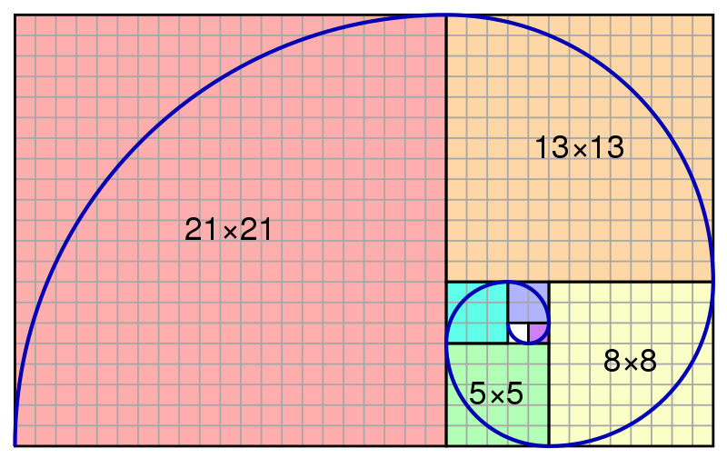

# Block 10 Workshop: The Picasso Painting

## Overview

A local art gallery is looking for curated digital forms of abstract art using CSS. You have mastered the art of flex, grid, and many more advanced CSS techniques, so you decide to create a piece for the gallery.

Below your artwork, include a form for visitors to input their name and email if they are interested in purchasing a digital copy of your work.

Remember to use the MDN documentation if you need help. An internet search for "mdn `<thing you are trying to do>`" usually works great for getting you to the correct MDN page you want!

Webpage using rectangles, circles, and triangles to make a piece of art.

## Requirements

- Use grid or flex.
- Use three various types of CSS units.
- Make sure it works on all screen sizes. Some people will not be able to attend the gallery but they have a virtual gallery room.
  Desktop: 1680 x 1050
  iPad: 1024 x 768
  Mobile: 480 x 320
- You must use z-index and hierarchical selectors in the code.
- Use common shorthand where applicable.
- dd an HTML form to collect the names and emails of interested visitors.
- It should have a submit button and the form's action will take the user to another HTML page.
- Note: the form does not actually need to collect information! You can direct the user to another HTML page by assigning a value to the `<form>`'s action attribute.

## My Notes

I wanted to play with overlaying css grid and flexbox organization patterns.

The background of this image is organized in the manner of the "golden ratio" using css grid. I chose a blue that I liked and then simply increased the amount of green by 10 for each grid using https://htmlcolorcodes.com/.

The foreground overlays text using a variety of spacing methods and z-indexes, allowing playful overlay. The colors were curated from another golden ratio source: https://goldenratiocolors.com/starter-colour-palette-scheme-base-colours/. Font sizes were also based on the golden ratio multiple 1.618.
